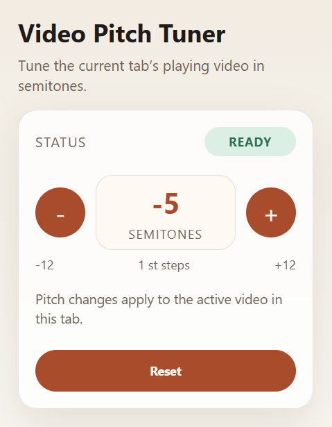

# Video Pitch Tuner

A Microsoft Edge extension that changes the pitch of the active page video without changing playback speed.

## Build

1. Run `npm install`.
2. Run `npm run build`.

The built extension is written to `dist/`.

## Load in Edge

1. Open `edge://extensions`.
2. Enable **Developer mode**.
3. Click **Load unpacked**.
4. Select the `dist/` folder.

## Package

Run `npm run package` to create `package.zip` from the production build.

## Use

1. Open a page with an HTML5 video element.
2. Start playback.
3. Open the extension popup.
4. Use `-` or `+` to lower or raise the pitch in one-semitone steps.
5. Use **Reset** to return to the original pitch.

## Behavior

- Pitch range is `-12` to `+12` semitones.
- Adjustments are whole semitones only.
- The popup shows `Ready`, `No Video`, or `Unsupported` depending on the active tab state.
- The extension tracks the active page video and prefers the currently playing one if multiple `video` elements exist.

## Notes

- This version targets standard top-document HTML5 `video` elements.
- State is per tab session and resets when the tab reloads or closes.
- Some sites with custom protected players, unusual audio pipelines, or cross-origin iframe players may show as unsupported.

## Debug audio graph issues

Diagnostics are only included in debug builds. Run `npm run build:debug`, load `dist/`, then use the helper from the page DevTools console.

1. Open DevTools on the video page and select the extension/content-script execution context.
2. Run `__videoPitchTunerDebug.enable()`.
3. Apply a pitch change and run `__videoPitchTunerDebug.snapshot()`.

In a healthy graph, `connectedWorkletIds` should contain one id and `currentVideoMatchesActive` should be `true`. Use `__videoPitchTunerDebug.events()` to inspect recent graph build/release events, or `await __videoPitchTunerDebug.rebuild()` to force a clean graph rebuild for the active video.
